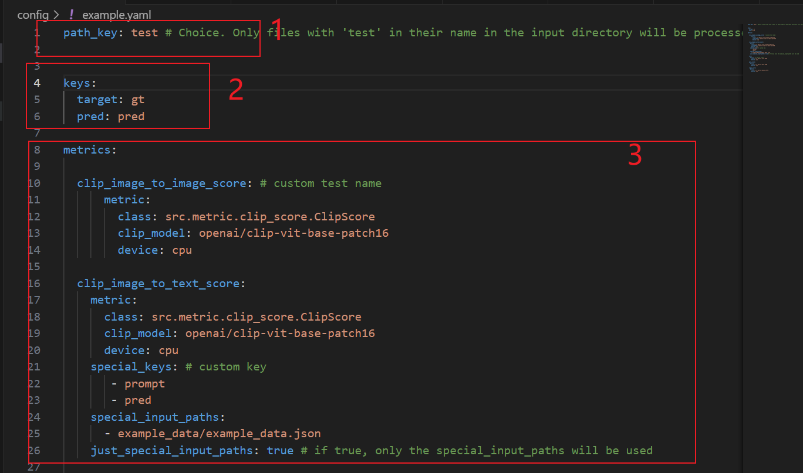

# 中文教程


[ ]（视频正在录制）
## 文件结构
确定待测试的文件以下列形式排布
### 文件夹格式
```bash
input_path
├── input_dir1 
│   ├── dir1 
│   │   ├── img1.jpg # all the filename must match in each dir
│   │   ├── img2.jpg 
│   │   └── ...
│   └── dir2 
│       ├── img1.jpg
│       ├── img2.jpg
│       └── ...
│
├── input_dir2 
│   ├── dir1 
│       └── ...
│   └── dir2 
│       └── ...
...
```

### JSON 格式
```json
[
    {
        "args1": "image path or text of target",
        "args2": "image path or text of pred",
    },
    
    {
            ...
    },
    {
        "args1": "image path or text of target",
        "args2": "image path or text of pred",
    }
]
```

### **!!!下文提到的`keys`的概念其实就是文件结构的 'dir1'&'dir2' 或者 'args1'&'args2'。!!!**

## 配置文件如何使用



### 通用文件夹指定（SEC.1 & SEC.2）

本例中，所有在`--input_path`下含有'test'关键字的文件夹都会被测试。对于每个文件夹测试其中的'gt','pred'文件夹。

图中第二部分的`keys`指定了通用路径被测试的关键字。这里为了标准化,只允许指定`target key`和`pred key`。

（这样做是为了方便批量测试，例如ssim、clip score都需要对生成图象和GT图像做对比。可以避免重复输入路径。）

### 具体Metric配置 
`Metric：`指定了测试的类

`special_input_paths：`指定了针对该Metric需要单独测试的 json 或者 dir 路径。


`special_keys:`指定特殊的keys(可以任意数量)，keys的顺序在大部分Metric下无影响，需要根据Metric类具体确定。

`just_special_input_paths:`设定为true，则只测试special_input_paths,忽略上面指定的通用文件夹。

例如本例需要特殊计算文字与图像的clip score。忽略通用路径、指定json路径、指定keys: 'prompt'和'pred'。（clip score代码会自动分别路径和prompt，顺序其实无所谓）


